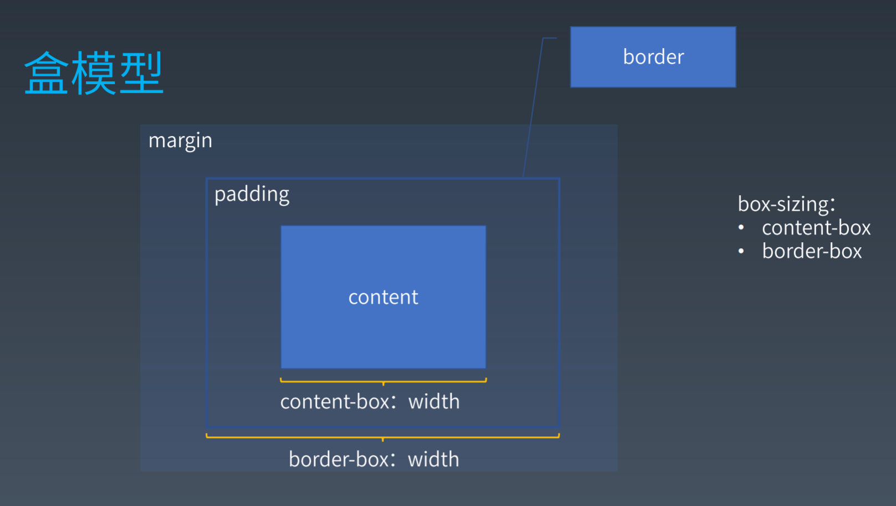

# 每周总结可以写在这里

## 1. 选择器语法

1. 简单选择器

+ *
+ svg|a
+ #id
+ [attr=value]
+ :hover
+ ::before

## 2. 复合选择器

<简单选择器> <简单选择器> <简单选择器>
简单选择器组合

## 3. 复杂选择器

+ <复合选择器> <复合选择器>
  - 子孙
  - 后代，表示选中所有符合条件的后代节点
+ <复合选择器> ">" <复合选择器>
  - 子选择器，只能选择子一级
  - 子代，表示选中符合条件的子节点
+ <复合选择器> "~" <复合选择器>
  - 兄弟 sibling
  - 后继，表示选中所有符合条件的后继节点，后继节点即跟当前节点具有同一个父元素，并出现在它之后的节点
+ <复合选择器> "+" <复合选择器>
  - 兄弟 sibling
  - 直接后继，表示选中符合条件的直接后继节点，直接后继节点即 nextSlibling
+ <复合选择器> "||" <复合选择器>
  - 

## 4. 伪类

### 链接/行为
+ :any-link
+ :link :visited
+ :hover
+ :active
+ :focus
+ :target
### 树结构
+ :empty
+ :nth-child()
+ :nth-last-child()
+ :first-child :last-child :only-child
### 逻辑性
+ :not伪类
+ :where :has
## 5. 伪元素
+ ::before
+ ::after
+ ::firstline
+ ::first-letter

## 6. 排版
```
margin可以理解为留白

padding理解为边距
```

### BOX 盒
+ HTML代码中可以书写开始标签、结束标签和自封闭标签；
+ 一对起止标签，表示一个元素。
+ DOM树中存储的是元素和其他类型的节点（Node）。
+ CSS选择器中选中的是元素
+ CSS选择器中选中的是元素，在排版时可能产生多个盒
+ 排版和渲染的基本单位是盒
```
为什么border-box不叫margin-box？

因为不包含margin
```




